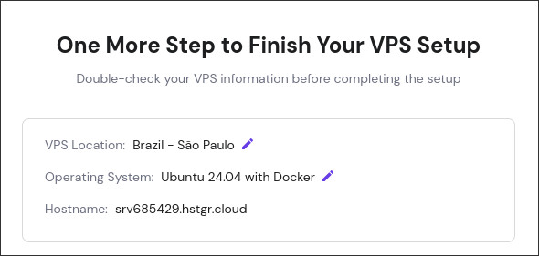

After some research we went with hostinger as a hosting provider for the server. https://www.hostinger.com/pricing/1?content=vps-hosting

Choose KVM 2 it has plenty of resources for our purposes (2 years might be best price but a bit much in advance, go with what you are comfortable with, but mind you, the rebill is more expensive after the first bill)

create an account or log in with google or another service and once the payment is done we can proceed with the configuration.

Choose `Brazil` as a location for the server

For our operating system, we want to use a preinstalled docker application, it will automatically install ubuntu and docker for us.

make sure to set a secure root password! Pro Tip: use a password manager! it can create passwords and save them for you

Make sure everything is correct and send it!

It's gonna take like a minute to set everything up.

Once its done select manage VPS, video tutorial from here!