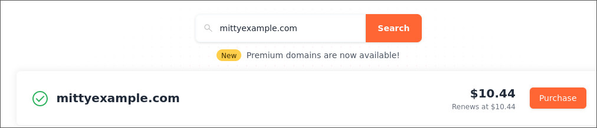
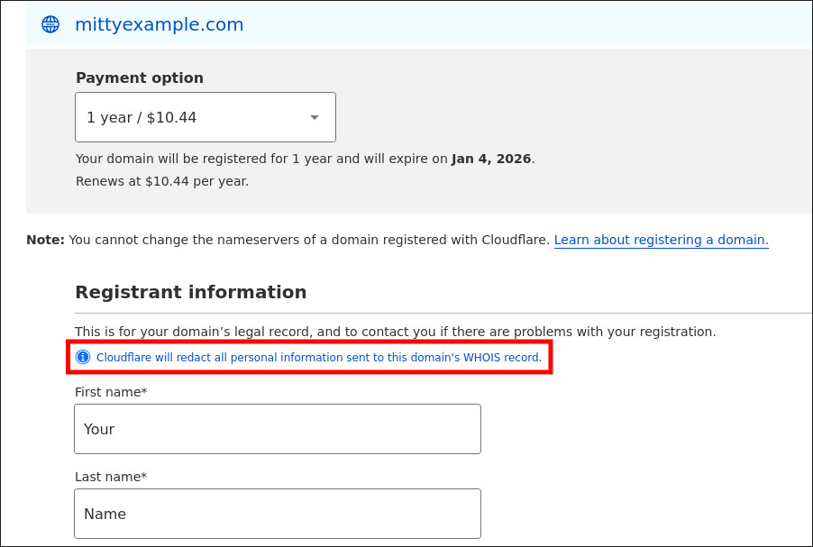
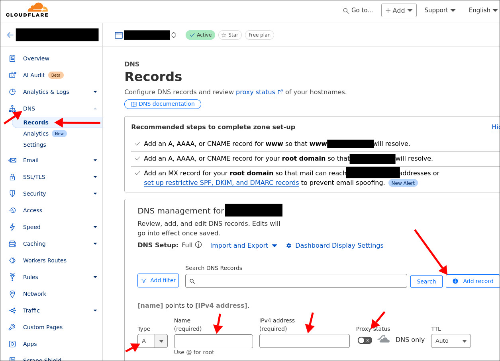

For the domain we recommend cloudflare as the registrar https://domains.cloudflare.com/?domain=mittyexample.com

these are bought for a year and the price you pay on it is also billed yearly, but they may vary from 5-12 bucks or a bit higher depending on the ending

Once you found a nice domain click purchase and fill in your info, mind that none of this is gonna make it into the WHOIS info! this is only for cloudflare internally

Next step assumes you bought the domain and are logged into your account.

you can now select your domain and go to DNS records

there you can `Add record`

and choose a `Type A` record, pick a name for your subdomain (or @ for just the apex domain) and type in the IP from your hosted server. Don't have a server? [check here!](Hosting.md)

Make sure to uncheck the proxy! or we will have trouble later to request a valid certificate for the server

it might take a couple of minutes but your server should now be reachable from this domain!

Optional Pro tip: you can also add more CNAME records to redirect to your various sites from your domain!

e.g.: 

- carrd.yourdomain.com -> mitty.carrd.co
- shop.yourdomain.com -> mittymarket.com
- terminal.yourdomain.com -> mitty-terminal.uwu.ai
- booru.yourdomain.com -> the booru! (this is a Type A record!)
